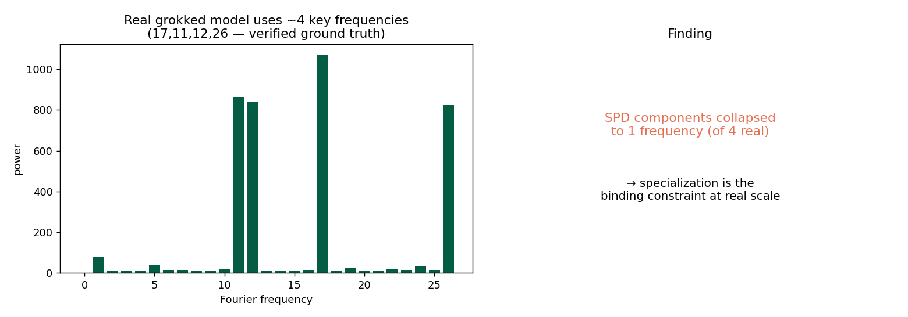

> Part of a 7-repo mechanistic-interpretability series by **Emmanuel Effiom Duke** ([duker.me](https://duker.me)) on automated mechanism clustering for Stochastic Parameter Decomposition (SPD). See the full write-up: *Specialization Is the Bottleneck* (paper).

---

# SPD on a Real Grokked Transformer (Modular Addition)

**By Emmanuel Effiom Duke** ([duker.me](https://duker.me)) · CPU, 2026-07-15
5th experiment — moves from toy models to a **real trained transformer**.

## Setup
Trained a small transformer (embedding + attention + MLP, d_model=64) on **(a+b) mod 53** with weight decay. It **grokked to 100% test accuracy** — i.e. learned the real algorithm. Grokked mod-add models are known (Nanda et al. 2023) to represent numbers on a few Fourier frequencies. We applied SPD to the MLP up-projection and asked: do clustered components recover the frequency structure?

## Independently-verified ground truth
The model's embedding uses **~4 key frequencies** (17, 11, 12, 26) — 91% of spectral power in the top-5. This is measured directly from the embedding DFT, independent of SPD.

## Result
- Model: 100% test accuracy, ~4 real frequencies (verified). ✓
- SPD components: **all collapsed onto the single dominant frequency (17)**; clustering-vs-frequency ARI = 0.
- Cause: importance-minimality stayed saturated (imp ≈ 1.0) — **components never specialized** in the training budget on this larger layer.

## Conclusion — the through-line of the whole project
Across five experiments (TMS, balanced TMS, compositional MLP, and this real transformer), one finding is consistent and gets *stronger* with scale:

> **The binding constraint on automated mechanism recovery is SPD component specialization, not the choice of clustering signal.** When components cleanly map to single mechanisms (easy TMS), simple co-activation recovers structure (ARI 0.53). As targets get realistic, components fail to specialize and *no* clustering signal — co-activation, attribution, or causal double-ablation — recovers the (independently verified) ground-truth mechanisms.

This redirects the SPD clustering agenda: **invest in gate/component specialization (sharper L0 gates, longer/stronger sparsity schedules, per-mechanism capacity) before clustering-signal design.**

## References
- Bushnaq, Braun, Sharkey (2025). *Stochastic Parameter Decomposition.* arXiv:2506.20790.
- Nanda et al. (2023). *Progress measures for grokking via mechanistic interpretability.* ICLR.
- Elhage et al. (2022). *Toy Models of Superposition.* Anthropic.
